<p align="center">
  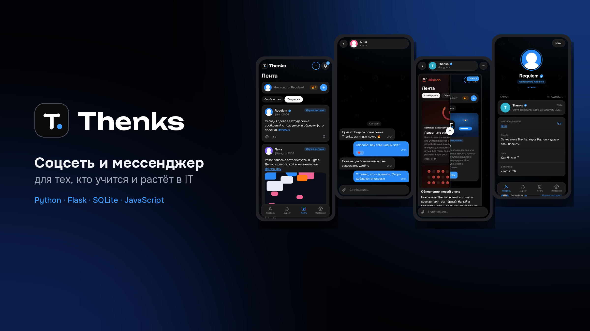
</p>

# Thenks

**Соцсеть и мессенджер для тех, кто учится и растёт в IT.** Лента с отметками «Что изучил сегодня» и вехами на пути (первый проект, первый заказ, оффер), личные чаты, группы и каналы.

🔗 **Живая версия:** https://lojix.pythonanywhere.com

Проект целиком сделан одним человеком: от базы данных и безопасности до дизайна, анимаций и деплоя.

---

## Скриншоты

| Лента | Директ | Чат | Меню сообщения |
|:---:|:---:|:---:|:---:|
| 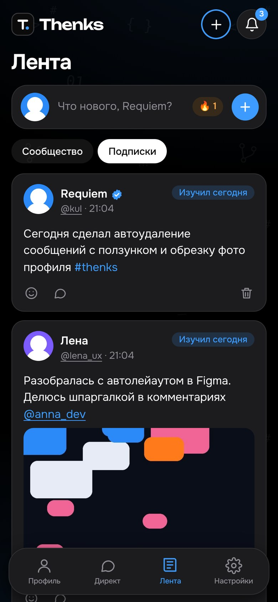 | 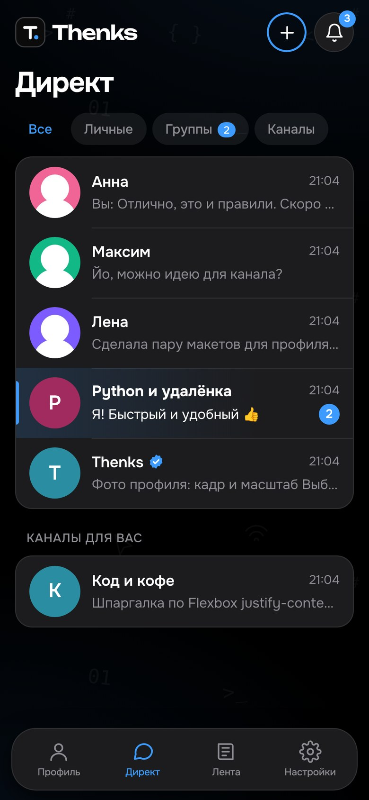 | 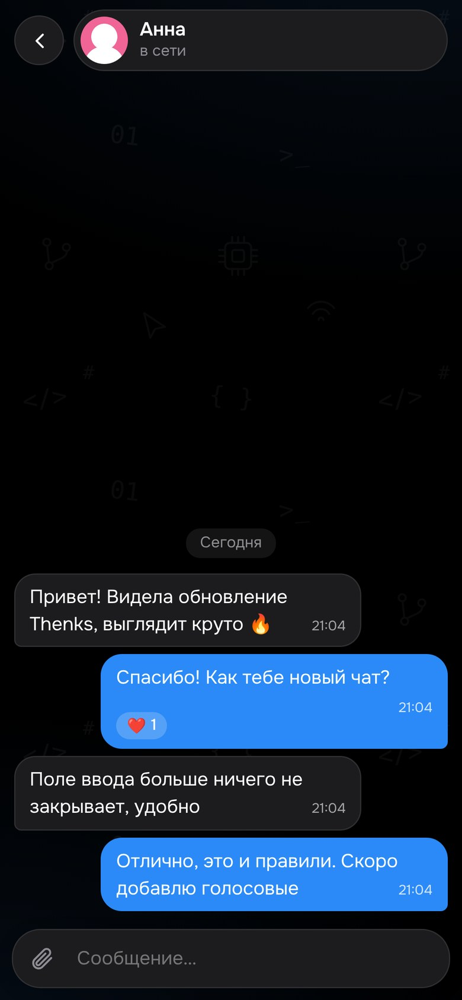 | 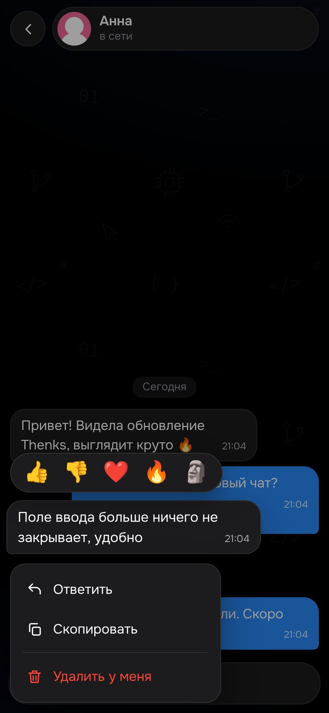 |

| Канал: «до / после» | Профиль | Автоудаление | Оформление |
|:---:|:---:|:---:|:---:|
| 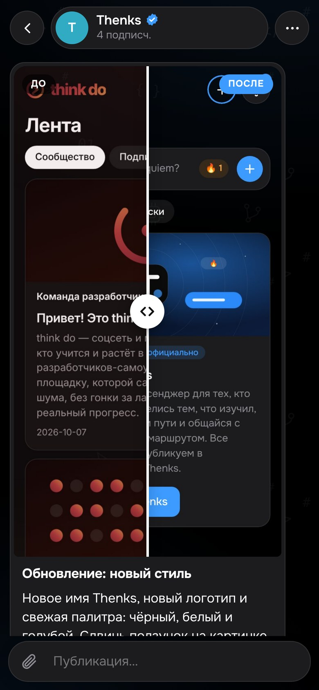 | 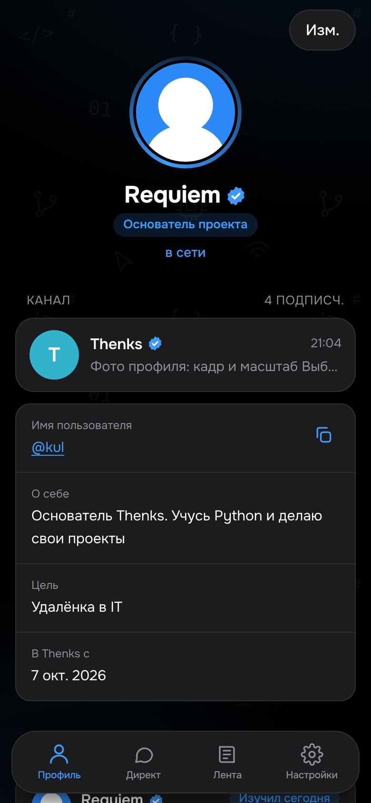 | 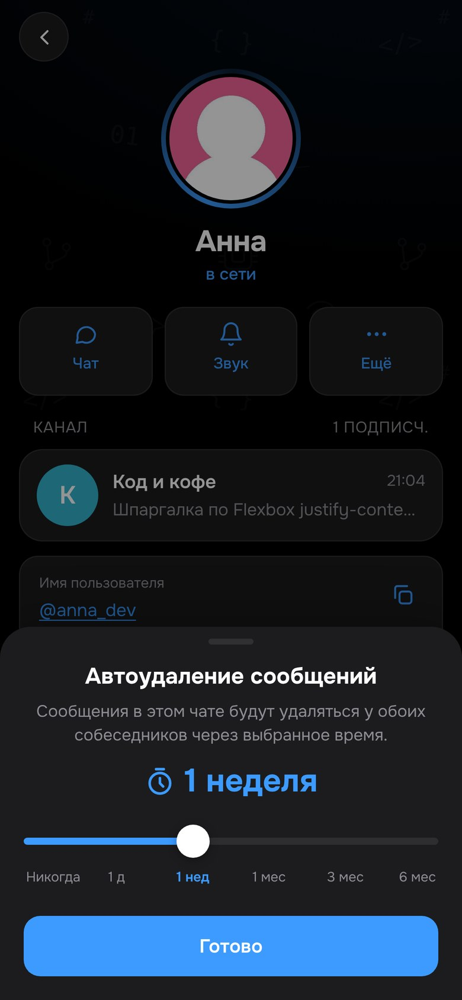 | 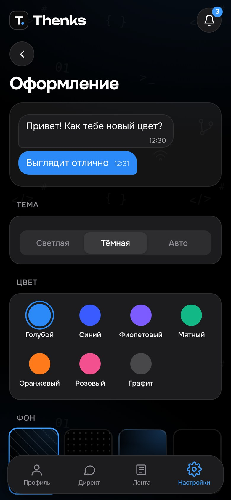 |

**Светлая тема**

| Лента | Чат | Профиль | Настройки |
|:---:|:---:|:---:|:---:|
| 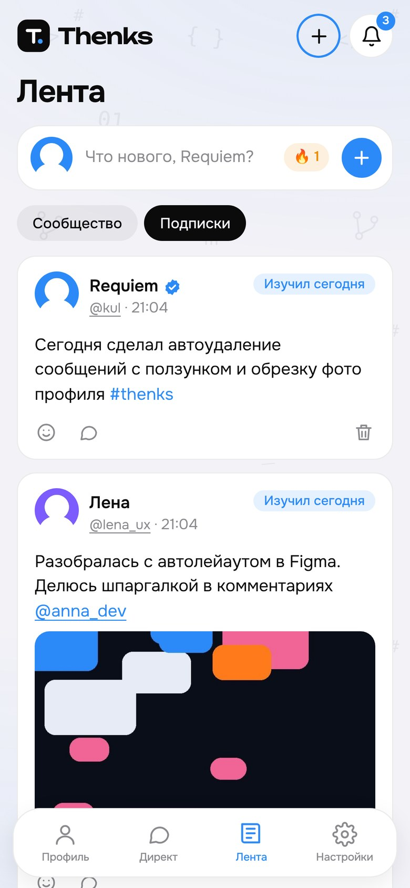 | 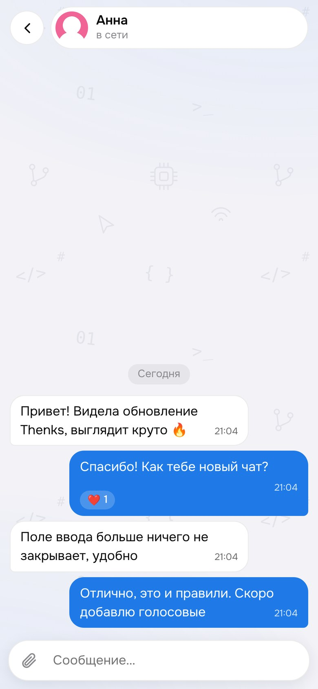 | 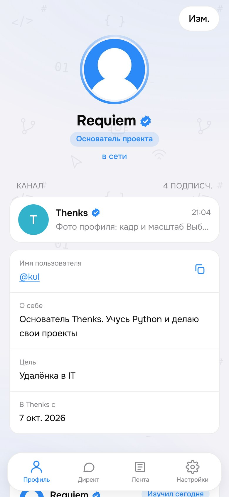 | 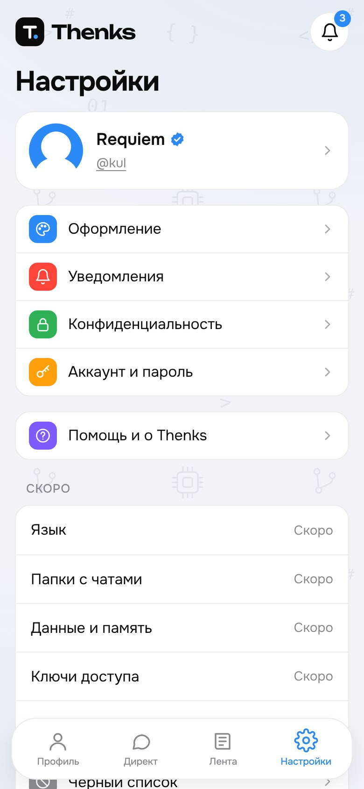 |

**Компьютер**

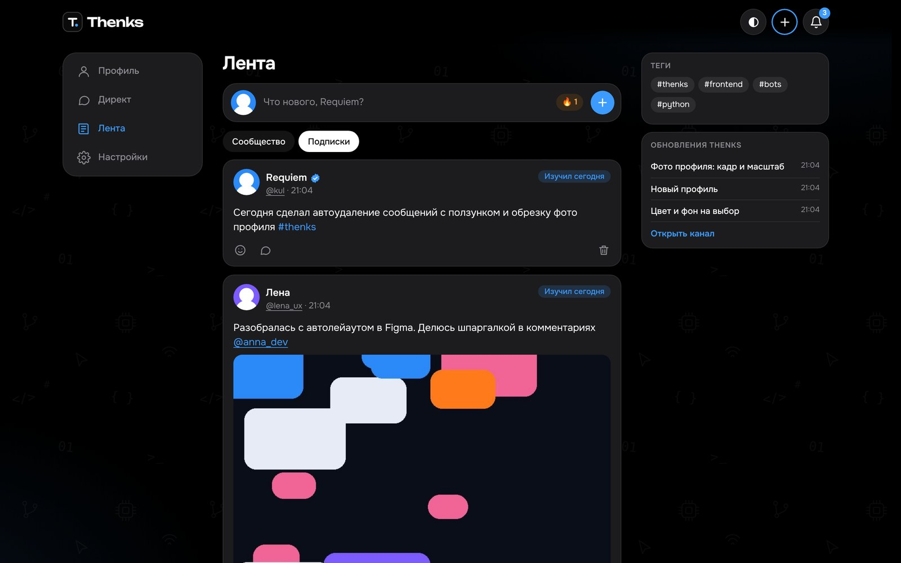
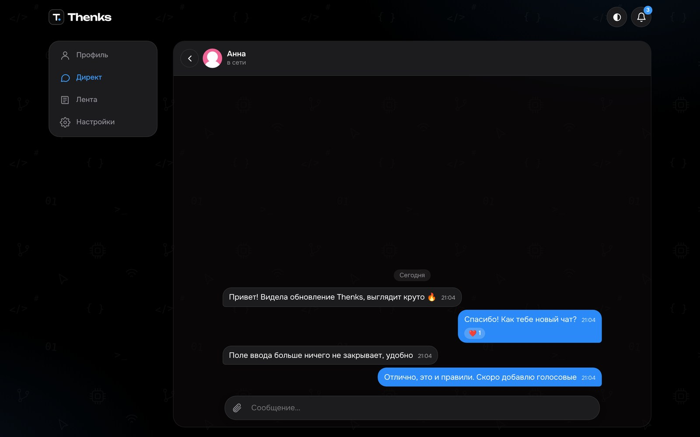

---

## Возможности

**Лента и профиль**
- Публикации трёх типов: обычный пост, «Что изучил сегодня» (с серией дней подряд) и веха
- Фото в постах, реакции (👍 👎 ❤️ 🔥 🗿), комментарии, #хэштеги и @упоминания
- Профиль с каналом автора, публикациями и вехами
- Обрезка фото профиля: выбор кадра и масштаба, жест двумя пальцами
- Подписки, уведомления, чёрный список

**Мессенджер**
- Личные чаты, группы и каналы (публичные и частные по ссылке-приглашению)
- Ответ на сообщение свайпом, меню по долгому нажатию в стиле iOS: реакции, ответ, копирование, правка, удаление у себя и у всех
- Отправка без перезагрузки страницы с мгновенным показом сообщения
- Автоудаление сообщений: от 1 дня до 6 месяцев, ползунком
- Посты каналов с несколькими фото и видео и сравнение «до / после» с перетаскиваемым разделителем
- Счётчики непрочитанных, которые обновляются сами

**Интерфейс**
- Адаптивный дизайн: телефон (нижняя панель вкладок) и компьютер (боковое меню и правая колонка)
- Светлая и тёмная тема, 7 цветов акцента, 4 варианта фона
- Переходы между страницами без перезагрузки (SPA на чистом JavaScript), предзагрузка страницы при нажатии
- Плавные анимации, поддержка режима «Уменьшение движения»
- Корректная работа с клавиатурой на iPhone: поле ввода всегда над клавиатурой

**Конфиденциальность** (как в Telegram)
- Кто видит время захода, фото профиля и «О себе»: все, мои подписки, никто
- Кто может писать, комментировать и добавлять в группы
- Автоудаление аккаунта, если не заходить 1–12 месяцев

**Безопасность**
- Пароли хранятся только в виде хэшей (werkzeug)
- Защита от CSRF во всех формах, Content Security Policy с nonce, запрет встраивания во фреймы
- Ограничение попыток входа
- Проверка загружаемых файлов по содержимому, а не по расширению; фото перекодируются, метаданные (EXIF, GPS) удаляются
- Ежедневная резервная копия базы (хранятся последние 7)

---

## Технологии

| Часть | Что использовано |
|---|---|
| Сервер | Python 3, Flask |
| База данных | SQLite, миграции схемы при запуске |
| Изображения | Pillow |
| Интерфейс | HTML, CSS, JavaScript без фреймворков |
| Хостинг | PythonAnywhere |

Весь проект в одном файле `app.py` (≈3 400 строк): маршруты, шаблоны, стили и скрипт интерфейса.

---

## Запуск у себя

```bash
git clone https://github.com/BolnoyParen/thanks.git
cd thanks
python3 -m pip install -r requirements.txt
KRUG_HTTPS=0 python3 app.py
```

Открыть в браузере: http://127.0.0.1:5000

При первом запуске рядом с `app.py` создаются база `krug.db`, ключ `secret.key` и папки `uploads/` и `backups/`. Их нельзя выкладывать в публичный репозиторий, поэтому они перечислены в `.gitignore`.

Папка `seed_media/` содержит фото и видео для постов официального канала, они прикрепляются автоматически.

---

## Автор

**Requiem**: перехожу из строительства в IT, учусь Python и веб-разработке на реальных проектах.
